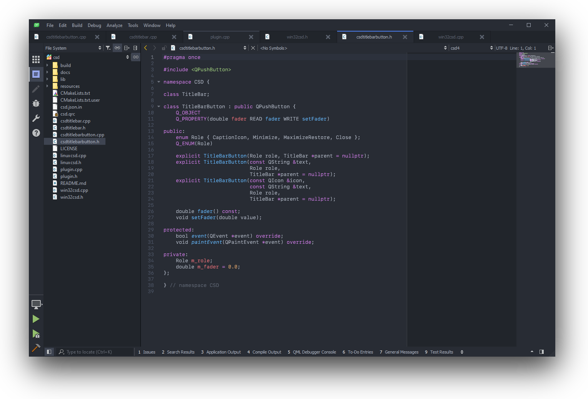

# qtcreator-plugin-tabs

Tabs for [Qt Creator](http://qt-project.org/wiki/Category:Tools::QtCreator).


[](https://github.com/Longhanks/qtcreator-plugin-tabs/actions)

## Screenshot



## Copyright / License

Copyright (C) 2019 Andreas Schulz. All rights reserved.

Licensed under the [MIT](https://github.com/Longhanks/qtcreator-plugin-tabs/blob/master/LICENSE) License.

## Dependencies

This plugin depends on the [LayoutSupport](https://github.com/Longhanks/qtcreator-plugin-layoutsupport) plugin.

## Build instructions

Provide the following variables to cmake:

| Variable            | Value                                             |
| ------------------- | ------------------------------------------------- |
| `QTCREATOR_SRC`     | Path to directory containing Qt Creator source    |
| `QTCREATOR_VERSION` | Target version of Qt Creator (defaults to 4.11.0) |

On macOS and Linux, the following variable is needed to find Qt Creator's plugin libraries:

| Variable            | Value                                             |
| ------------------- | ------------------------------------------------- |
| `QTCREATOR_BIN`     | Path to Qt Creator executable binary              |

### Examples

#### Linux (Fedora)

The main difference here is that on Linux - since most distributions ship quite recente versions of QtCreator - we override the `QTCREATOR_VERSION` value.

```sh
mkdir build && cd build
cmake .. -DCMAKE_BUILD_TYPE=Release -DQTCREATOR_SRC="~/Downloads/qt-creator-opensource-src-5.0.1" -DQTCREATOR_BIN="/usr/bin/qtcreator -DQTCREATOR_VERSION="5.0.1"
make
sudo make install
```

#### macOS

```
mkdir build && cd build
cmake .. -DCMAKE_BUILD_TYPE=Release -DQTCREATOR_SRC="~/Downloads/qt-creator-opensource-src-4.11.0" -DQTCREATOR_BIN="/Applications/Qt Creator.app/Contents/MacOS/Qt Creator"
make
sudo make install
```

#### Windows

This example uses the Ninja build system.

```
mkdir build && cd build
cmake .. -DCMAKE_BUILD_TYPE=Release -DCMAKE_PREFIX_PATH=C:/Qt/5.13.2/msvc2017_64 -DQTCREATOR_SRC=C:/Users/aschulz/Projects/qt-creator-opensource-src-4.11.0 -GNinja
ninja
ninja install
```
